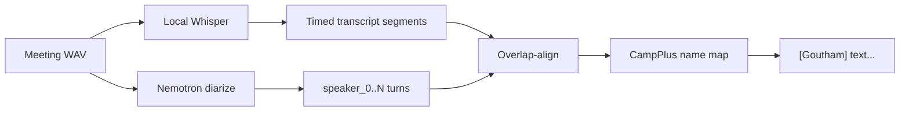

# Integrate Nemotron-3-Diarization into Buddy

Superseded for implementation: Buddy uses the Windows CPU build of NeMo-Speech.cpp with `Nemotron-3-Diarization.q8_0.gguf` (`--preset v3-offline`), not the torch path described below. The setting defaults to off until that runtime is downloaded.

Plan for adding [NVIDIA Nemotron-3-Diarization](https://huggingface.co/nvidia/Nemotron-3-Diarization) to Buddy’s meeting pipeline.

**Overview:** Use Nemotron as the post-meeting “who spoke when” engine, then map those anonymous speakers onto enrolled CampPlus voice names — without replacing live Voice ID.

## Roles

| System | Job |
|--------|-----|
| **Nemotron-3-Diarization** | Who spoke when (up to 8 anonymous speakers, Sortformer / streaming-capable) |
| **CampPlus + Qdrant** | Who that person is (named enrollments) |
| **Whisper** | What was said (timed transcript segments) |

Those jobs are complementary. Do **not** replace Voice ID with Nemotron alone — Nemotron outputs `speaker_0`, `speaker_1`, not “Goutham”.



## Chosen approach (v1)

**Hybrid offline labeling:**

1. Whisper still produces timed text (unchanged).
2. After stop, run Nemotron offline on the saved recording → `[{start, end, speakerIndex}]`.
3. Assign each Whisper segment the diarization speaker with most overlap.
4. For each diarization speaker, take a few voiced clips and match against enrolled CampPlus voices; enrolled hits become names, others stay `Speaker 1/2`.
5. Live icon labeling stays on CampPlus windows (fast, already working).

**Runtime:** Hugging Face Transformers path first (`AutoModelForAudioFrameClassification` + `AutoProcessor` from the model card). Fits a Buddy Python sidecar better than full `nemo-toolkit[asr]`. Cache weights under AppData (`speaker-models/nemotron-diarization`). Prefer CUDA; fall back to CPU with a Settings warning that long meetings will be slow.

**Out of scope for v1:** streaming Nemotron during live record, NeMo-Speech.cpp packaging, cloud NVIDIA NIM, replacing CampPlus enroll/test UI.

## Implementation

### 1. Python sidecar

Add `scripts/diarize_nemotron.py` (or extend a thin JSON-line sidecar like `scripts/speaker_id.py`):

- `cmd: "diarize"` with `{ audio, sample_rate? }`
- Load `nvidia/Nemotron-3-Diarization` once; offline buffer config (~30.4 s / model-card defaults)
- Return `{ ok, segments: [{ start, end, speaker }], device }`
- `cmd: "status"` for dependency/GPU readiness

### 2. Electron wrapper

Add `electron/diarize.cjs`:

- Spawn/manage the sidecar (same pattern as `speakers.cjs`)
- `check()`, `diarizeFile(path)`, `stop()`
- Cache dir under `app.getPath("userData")`

Wire into `electron/meetingPipeline.cjs` after Whisper, before summary:

```
Whisper → Nemotron diarize (if enabled) → map speakers → CampPlus name → summary
```

If diarize fails or is disabled, fall back to today’s `speakers.labelSegments` (live turns + CampPlus embeds).

### 3. Align + name

- `alignWhisperToDiarization(whisperSegs, diarSegs)` — majority-overlap speaker id per Whisper segment
- `nameDiarizationSpeakers(audioPath, diarSegs)` — sample clips per `speakerIndex`, match against Qdrant; build `speakerIndex → "Goutham" | "Speaker N"`
- Emit the same `[Name] text` transcript format used by summarization

### 4. Settings + capabilities

- Config: `diarizationBackend: "off" | "nemotron"` (default `off` until deps ready)
- Settings Meet section: toggle **Neural diarization (Nemotron)** + status chip (ready / needs torch+CUDA / download pending)
- Extend `checkMeetingDeps` so Meet can show “Diarization: ready”
- Document HF download size / first-run wait in README

### 5. Performance / product constraints

- Warm the model once at first Meet use or app idle when possible
- Skip Nemotron for clips shorter than ~5s (CampPlus-only is enough)
- Progress: `Transcribing…` → `Finding who spoke when…` → `Naming speakers…` → `Summarizing…`
- Sidecar uses `windowsHide` (no Terminal popup)

### 6. Verify

- Two-speaker headset+system recording: two labels; enrolled name maps correctly
- One enrolled voice + one stranger: enrolled named, stranger `Speaker 2`
- Toggle off → old CampPlus/live-turn path still works
- No GPU → warning + optional CPU path or graceful skip

## Later (not v1)

- Stream Nemotron chunks for live “Speaker 2” before naming
- NeMo-Speech.cpp for a smaller offline binary
- Cloud STT / LLM providers remain a separate track

## Implementation checklist

- [ ] Add Nemotron Python diarize sidecar (`status` + `diarize` → speaker segments)
- [ ] Add `electron/diarize.cjs` and wire `meetingPipeline` after Whisper
- [ ] Align Whisper segments to diarization turns; name speakers via CampPlus/Qdrant
- [ ] Settings toggle + deps check + progress strings; default off until ready
- [ ] Smoke two-speaker meeting with enroll; confirm fallback when diarize off/fails
